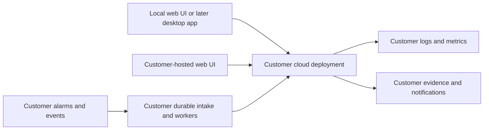

**Kira: customer-owned open-source project roadmap**

Revised 1 October 2026 to reflect the user's explicit direction. Tracker: [PRODUCT_ROADMAP_TRACKER.md](/Users/hamzashoaib/Documents/Side-hustles/AIOps-Agent/PRODUCT_ROADMAP_TRACKER.md). Reliability baseline: [PRODUCTION_IMPLEMENTATION_PLAN.md](/Users/hamzashoaib/Documents/Side-hustles/AIOps-Agent/PRODUCTION_IMPLEMENTATION_PLAN.md) and [IMPLEMENTATION_TRACKER.md](/Users/hamzashoaib/Documents/Side-hustles/AIOps-Agent/IMPLEMENTATION_TRACKER.md).

**Confirmed product scope.** Publish an open-source project that users deploy and operate in their own cloud accounts. The project supplies code, infrastructure templates, supported configuration methods, release artifacts, and documentation for web chat, automatic alert investigations, and notifications. A later macOS/Windows application runs locally and connects to the user's cloud resources using their identity/credentials. The customer owns the infrastructure, access, operating decisions, and cloud/model charges. Maintainers do not host the application or manage customer environments.

The first supported cloud remains AWS because the current implementation uses EC2, CloudWatch, Bedrock Agents, Lambda, EventBridge, and SNS. The production plan adds durable processing and evidence storage inside that same customer-controlled deployment. Document tested regions, model access, service prerequisites, and limits. Other clouds may receive future implementations, but are not an implied promise of this release.

| Responsibility | Open-source project | Customer/operator |
|---|---|---|
| Application | Source, reviewed releases, tests, examples, documentation, issue/security reporting | Select/install versions and configure supported features |
| Infrastructure | Reusable templates and lifecycle instructions | Own account/resources, deploy, pay costs, operate, upgrade and remove |
| Identity and secrets | Least-privilege policy examples and secure credential handling | Provision/revoke access, select profiles/roles, rotate credentials |
| Logs, metrics, incidents, evidence | Read/processing contracts, redaction, retention configuration | Own data and access, choose region/model, configure collection and retention |
| Notifications | Supported integration code and verification procedure | Own destinations/subscriptions, verify receipt, respond to incidents |
| Recovery | Failure handling, tested recovery and rollback methods | Monitor deployment health, replay failures, restore data, manage capacity |
| Desktop | Local client source/installers and update verification | Install locally and connect to their own deployment |

**Deployment flow.** Users obtain a release, review prerequisites and permissions, configure their own account/regions/services/model, deploy the cloud stack, and import its non-secret connection settings. They can then use web chat locally or on their own hosted UI. Alarms trigger cloud investigations and send notifications through their configured destinations. The later desktop client supplies another local interface to the same deployment.

Cloud components perform unattended investigations. Closing the browser, stopping the web UI, or shutting down the desktop computer must not stop cloud alert processing. A locally running UI still needs connectivity to the customer's cloud; this is not a requirement to run models or all infrastructure offline on the laptop. Evidence processing uses the cloud/model services chosen by the customer, with the data flow documented.

**Architecture to retain.** Continue the existing AWS/Bedrock and Streamlit architecture while closing the audit findings. Generalize configuration, isolate environments, stabilize contracts and shared Python helpers, and make installation repeatable. A cloud-neutral orchestrator, PostgreSQL replacement, React rewrite, universal backend API, and fully local model runtime are not release prerequisites. A later desktop prototype should choose the smallest safe client integration: direct SDK access to the customer's agent when sufficient, or a small API deployed in that customer's account if job/report access warrants one. Any introduced API must have customer-controlled authentication and authorization.

**Connection methods.** For local web/desktop use, prefer the customer's federated/SSO session or an assumed-role profile with temporary credentials. For a web service in the customer cloud, prefer its workload role. The SDK credential chain can support documented profile/role methods; exact login and refresh behavior must be tested in the chosen client/runtime. [Boto3 credentials](https://docs.aws.amazon.com/boto3/latest/guide/credentials.html). If a static access-key fallback is supported, require narrow scope, safe storage and rotation instructions; do not embed keys in installers or ask for root credentials. Separate deployment permissions from everyday chat/runtime access. [AWS IAM guidance](https://docs.aws.amazon.com/IAM/latest/UserGuide/best-practices.html).

A deployment manifest may include stack/version, account, monitor/model regions, agent/alias IDs and permitted endpoints/resource identifiers. It must not include credentials or act as proof of authorization. Each client verifies identity/account and permissions when connecting. Users only receive the operations their role and the project's supported functions permit; this scope does not add arbitrary cloud administration or automatic remediation.

**Required release documentation.** Include a start-to-finish guide for prerequisites and cost categories; deployment/account verification; local browser UI; one tested customer-cloud UI recipe; telemetry setup; alert coverage; notification confirmation and receipt testing; credentials/session renewal; incidents and evidence; quotas and budgets; retries/replay; upgrades/rollback; backups/retention; and safe cleanup. Document current supported methods rather than requiring customers to infer steps from scripts. Prefer tagged artifacts and validated configuration over edits to application source.

**How this changes the previous proposal.** Managed SaaS, billing/subscriptions, vendor multi-tenancy, commercial hosting/support operations, and author-operated account/activation services are removed. The separate portable-server/model-engine rewrite and fully offline/local-engine tracks are also withdrawn as unnecessary for this scope. The prior OS* roadmap IDs are superseded, not completed; no implementation had started. This revision uses CE* IDs so changed deliverables cannot be mistaken for old completed work. Multi-user authorization inside one customer's deployment remains a security requirement.

**Relation to the production plan.** The 52 production-readiness tasks and all 20 findings still apply. Interpret production deployments as the project's qualification deployment and each customer's later installation. Operations owners are the customer/deployment operator, not a managed-service team. Reuse P1 configuration/tests, P2 infrastructure/releases, P3 reliability, P4 monitoring/runbooks, P5 access/evidence controls, and P6/P7 verification/lifecycle work. CE tasks add generic packaging, documentation, independent-account testing, open-source publication, and desktop delivery; overlapping work is linked rather than counted twice.

**Execution order.** First complete the production foundations, while designing parameterization and reusable connection logic early. Then finish CE1–CE4 and make a public release decision based on successful independent deployments. CE5 is the later desktop phase. Scope confirmation is complete; all engineering tasks below start NOT_STARTED. No cloud changes, public publication, or license application are authorized or performed merely by updating this document.

| Phase | Outcome | Tasks | Release boundary |
|---|---|---:|---|
| CE1 | Reusable customer-cloud deployment | 4 | Web/cloud release |
| CE2 | Documented web chat and customer onboarding | 4 | Web/cloud release |
| CE3 | Customer-owned automatic alerts and notifications | 4 | Web/cloud release |
| CE4 | Qualify and publish the open-source project | 4 | Web/cloud release |
| CE5 | Local macOS and Windows desktop application | 4 | Later desktop phase |

Planning estimate after the production foundations: approximately 2–4 additional engineering weeks for reusable installation, documentation, public-release preparation and independent validation; then approximately 3–5 weeks for desktop implementation and platform testing. These replace the earlier portable-product estimates. Allow additional tester/signing-account lead time. Re-estimate after CE1.01 and the desktop prototype; completed production tasks may supply much of the needed work.

**Phase CE1: Reusable customer-cloud deployment.** Web/cloud release.

**CE1.01 — Declare the supported deployment contract.** Prerequisites: none.

Document AWS as the first supported cloud, required services/model access, supported regions/runtimes, expected telemetry, accounts, cost categories, and customer operating responsibilities. Use sanitized examples.

Acceptance: A customer can determine prerequisites and scope without contacting the author; other clouds are not advertised as supported.

**CE1.02 — Parameterize and package the cloud stack.** Prerequisites: CE1.01.

Extend the production-plan infrastructure templates with deployment/environment names, account checks, regions, instance inventory, model choice, log prefix, retention, quotas, and notification destinations. Remove author-specific values and export a versioned, non-secret connection manifest.

Acceptance: A clean second account installs an isolated deployment without editing source, resource-name collisions, or contacting author-owned services.

**CE1.03 — Document and test cloud access methods.** Prerequisites: CE1.02.

Separate deployer, runtime, and interactive-user permissions. Prefer workload roles for cloud processes and customer federation/SSO or assumed-role profiles for local clients. Document scoped temporary credentials and an explicit static-key fallback with rotation if needed.

Acceptance: Customers can connect, renew expired sessions, revoke access, and verify the selected account; interactive chat identities cannot deploy infrastructure.

**CE1.04 — Add preflight and safe lifecycle commands.** Prerequisites: CE1.02, CE1.03.

Validate configuration and cloud capabilities before deployment, inspect partial API failures, produce a coverage report, and document upgrade, rollback, data retention, cleanup, and resource ownership. Reuse the production-plan release manifest.

Acceptance: Fresh install, repeat install, version upgrade, wrong-account rejection, and reviewed uninstall are tested with synthetic data.

**Phase CE2: Documented web chat and customer onboarding.** Web/cloud release.

**CE2.01 — Support local and customer-hosted web UI.** Prerequisites: CE1.04.

Keep Streamlit initially. Document a local browser UI with a supported Python environment and a versioned container option, plus one verified customer-cloud hosting recipe. Bind local-only mode to loopback; customer-hosted mode requires authenticated TLS access.

Acceptance: A user can choose local or hosted web chat and connect to their deployment without developer-specific configuration or author-hosted authentication.

**CE2.02 — Introduce connection profiles and setup checks.** Prerequisites: CE2.01.

Load account/region/agent alias and permitted service scope from the deployment manifest or explicit settings. Keep secret resolution separate. Show connection/account state, model availability, and actionable errors; prevent accidental environment switching.

Acceptance: The UI verifies a customer deployment and distinguishes missing permissions, expired login, unavailable model, and telemetry gaps.

**CE2.03 — Document a complete manual investigation.** Prerequisites: CE2.02.

Provide instance/service discovery, UTC incident-time examples, report/evidence interpretation, retry behavior, access requirements, data egress, and redacted diagnostic export. Include synthetic fixtures and a supported smoke test.

Acceptance: An independent customer obtains a grounded report using the written guide; diagnostics contain no credentials or private log payloads.

**CE2.04 — Verify team access and UI failure behavior.** Prerequisites: CE2.01, CE2.02, CE2.03.

Reuse production authentication, authorization, timeout, redaction, and bounded-history controls. Explain local single-user access versus customer-hosted team access and their different identity setup. Test expired/revoked access and client disconnects.

Acceptance: Local and hosted modes meet the production access controls; a web client failure cannot disable the cloud alert pipeline.

**Phase CE3: Customer-owned automatic alerts and notifications.** Web/cloud release.

**CE3.01 — Ship the alert setup and coverage guide.** Prerequisites: CE1.04.

Package service/instance inventory, CloudWatch alarms, EventBridge rules, durable intake, worker configuration, and telemetry setup from the production plan. Document required versus optional coverage and how to add/remove services.

Acceptance: A fresh deployment detects the documented service/telemetry failure cases, and missing mandatory coverage prevents a successful verification result.

**CE3.02 — Ship notification setup and delivery verification.** Prerequisites: CE3.01.

Document customer-owned SNS/email destinations first, confirmation, minimal/redacted content, retries, failure destinations, and an independent fallback route selected by the customer. Any additional channel requires its own supported adapter and verification.

Acceptance: A synthetic alert produces an initial notification and completed/degraded follow-up at the configured destination; publication and receipt are distinguished.

**CE3.03 — Document day-to-day operation and recovery.** Prerequisites: CE3.01, CE3.02.

Provide runbooks for backlog/DLQs, replay, model access errors, broken collectors, rotated credentials, changed recipients, retained evidence, service recovery, budgets, and version rollback. Customer staff are the named operators.

Acceptance: A customer operator can recover a failed report and inspect incident state with no maintainer access to the account.

**CE3.04 — Prove unattended cloud operation.** Prerequisites: CE2.04, CE3.03.

Run the inherited production fault matrix and an end-to-end alert with web UI stopped and all local clients disconnected. Verify duplicate suppression, deadlines, recoverable failures, evidence retention, and notification delivery.

Acceptance: Automatic investigations and notifications continue entirely through customer-owned cloud resources; no desktop/browser session or author backend is required.

**Phase CE4: Qualify and publish the open-source project.** Web/cloud release.

**CE4.01 — Complete license, security, and repository preparation.** Prerequisites: CE1.01.

Decide the license explicitly; Apache-2.0 remains a proposal. Review contribution/dependency/asset rights, source history, secrets, and test data. Add license/notices, contributing instructions, private security disclosure, supported versions, and project governance.

Acceptance: The source is legally redistributable under the chosen terms and contains no customer credentials/data; no license is applied merely by this plan.

**CE4.02 — Publish reproducible release artifacts and documentation.** Prerequisites: CE1.04, CE2.04, CE3.04, CE4.01.

Build versioned source archives, Lambda/deployment artifacts and web-UI images with hashes, provenance, dependency inventory, scans, release notes, and compatibility information. Publish exact installation/update/rollback instructions.

Acceptance: Artifacts map to reviewed source; a clean build and customer installation need no maintainer credentials, activation, license server, or mandatory telemetry.

**CE4.03 — Run independent customer-account validation.** Prerequisites: CE4.02.

Use at least two independent AWS accounts controlled by testers to exercise fresh deployment, local/hosted web chat, automatic triggers, real notifications, access revocation, upgrades, restore/recovery, and cleanup. Record documentation friction and fix it.

Acceptance: Each tester completes the supported workflow from published instructions without undocumented source edits or maintainer cloud access.

**CE4.04 — Make the public release decision.** Prerequisites: CE4.03.

Require the relevant production gates and all release-track acceptance evidence. Publish the approved open-source version only after the project proves successful. Define issue/security triage and release maintenance as project work; infrastructure operation stays with users.

Acceptance: The release is accurately described, independently installable, and supported by verification evidence; no customer-operated environment is presented as a maintainer-managed service.

**Phase CE5: Local macOS and Windows desktop application.** Later desktop phase.

**CE5.01 — Choose and prototype local client packaging.** Prerequisites: CE4.04.

Prototype a desktop UI and local cloud-client integration, with Tauri as a candidate rather than a required stack. Keep shared connection/session/report behavior reusable. Reuse direct AWS SDK invocation of the customer agent where sufficient; add a customer-deployed API only for features that actually need one.

Acceptance: A local prototype chats with a customer deployment without an author-operated relay; installer/runtime requirements and supported OS/CPU targets are explicit.

**CE5.02 — Implement secure local cloud connections.** Prerequisites: CE5.01.

Support customer profiles/SSO/role sessions through a tested SDK or local helper; keep credentials outside renderer JavaScript, source, diagnostics, and browser storage. Store only necessary secrets via platform-protected storage. Show selected account/region and support refresh, revocation, and profile removal.

Acceptance: Expired/revoked sessions, malicious rendered evidence, and profile changes cannot expose credentials or silently cross account boundaries.

**CE5.03 — Build, sign, and verify desktop releases.** Prerequisites: CE5.02.

Package for supported macOS/Windows targets, including any required helper. Sign/notarize as appropriate, verify update artifacts, isolate release keys, document manual updates/source builds, and test client/cloud compatibility and safe uninstall.

Acceptance: Fresh machines install/update/uninstall documented builds; tampered updates are rejected; removing the app does not delete customer-cloud resources.

**CE5.04 — Validate the local-to-cloud workflow.** Prerequisites: CE5.03.

Test login, chat, supported report views, reconnect, sleep/wake, proxies/custom certificates, profile removal, and cloud-version mismatch. Shut down the laptop during a triggered incident and verify independent cloud notification. Document that local UI does not mean offline investigation or local model execution.

Acceptance: The app provides a local interface to the customer deployment while automatic cloud investigations operate independently; no maintainer service participates.

**Publication and release gates.** A successful project can be released under the explicitly chosen open-source license after rights/history review and the acceptance checks. Publish tagged source, deployment artifacts, instructions, compatibility information, and a security reporting route. Keep ordinary installation/use independent of author-operated services. Retain the production plan's finding-closure requirements, and prove a second-account deployment, local and hosted chat, unattended alerts, actual notification receipt, credentials revocation, version upgrade, recovery, and cleanup. Desktop release additionally requires validated local credential handling, platform installers/updates, and cloud-version compatibility. No existing task is complete merely because the roadmap has been revised.
