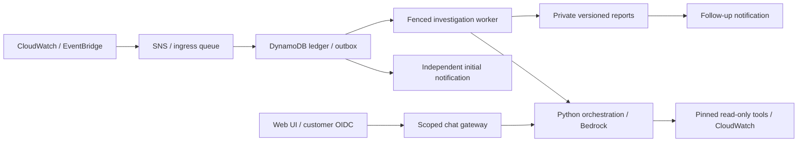

# Kira — AIOps Assistant

Kira investigates EC2 service incidents using CloudWatch logs and metrics and
Amazon Bedrock models. Run the web UI for scoped chat and incident reports; use
CloudWatch/EventBridge alerts for automatic investigation and notifications.

You deploy and operate every backend resource in your own AWS account. This
project provides no managed service. Choose `standalone` execution in Lambda or
`agentcore` execution in separate AWS AgentCore incident and chat runtimes. Both
use the same Python orchestration and read-only tools.

**Release status:** locally tested, with live AWS, OIDC, model, load, recovery and
real inbox qualification pending. Treat deployments as staging until you complete
[production acceptance](docs/PRODUCTION_CHECKLIST.md). Examples are synthetic;
cloud commands reject them until replaced with customer configuration.

## How it works



Initial notifications run independently of the model. Investigations use bounded
tokens, tool calls, query windows and deadlines. Reports retain qualified evidence
and uncertainty; missing logs alone do not prove a hung service. Users receive
individual viewer/investigator grants restricted to configured instances. Kira
does not automatically repair customer workloads.

See [architecture and workflows](docs/ARCHITECTURE.md).

## Local UI preview

Use Python 3.12. A preview needs no AWS resources:

```bash
python3.12 -m venv .venv
.venv/bin/python -m pip install --require-hashes -r requirements/app.lock
cp .env.example .env
```

If `.env` already exists, preserve it. Set `ENVIRONMENT=development` and a private
`APP_PASSWORD` of at least 12 characters. Keep the file private (`chmod 600 .env`).

```bash
.venv/bin/streamlit run app.py --server.address 127.0.0.1
```

Open `http://127.0.0.1:8501/`. Without verified backend configuration, the UI shows
setup guidance and disables chat. Preview login is separate from production SSO.

## Deploy in your AWS account

Start with the [administrator checklist](docs/ADMINISTRATOR_SETUP_CHECKLIST.md).
Before applying, you need:

- An AWS account and scoped operator, UI workload and CloudFormation roles.
- Existing monitored EC2 workloads, configured CloudWatch agents, exact inventory,
  metrics/logs, collector heartbeat and application readiness behavior.
- A Bedrock model/region supporting required token counting and Converse tools,
  with model access, sufficient quotas and an approved budget.
- A customer OIDC application with MFA, exact callback and authorized user subjects.
- Primary/fallback mailboxes, a fixed HTTPS incident-status URL, and operational owners.

Install the development lock for deployment/build tools, then download verified
Lambda wheels:

```bash
.venv/bin/python -m pip install --require-hashes -r requirements/dev.lock
.venv/bin/python -m pip download --require-hashes --only-binary=:all: --dest .build/wheels -r requirements/lambda.lock
.venv/bin/python -m infra.automation init --work-dir .local/customer
```

Fill the three generated private JSON files. Then preview and check:

```bash
.venv/bin/python -m infra.automation dry-run --config .local/customer/automation.json --work-dir .local/customer
.venv/bin/python -m infra.automation check --config .local/customer/automation.json --work-dir .local/customer
```

`dry-run` makes no AWS calls. `check` uses read-only APIs and a conservative
permission screen. Review the plan before applying with its displayed hash:

```bash
.venv/bin/python -m infra.automation apply --config .local/customer/automation.json --work-dir .local/customer --plan-hash YOUR_PLAN_HASH
.venv/bin/python -m infra.automation status --work-dir .local/customer
```

`apply` creates billable backend resources and resumes interrupted stages. It
stops for native login/canary and human dependencies. It does not create monitored
EC2 workloads, install collectors, register an IdP, host the UI or confirm inboxes.
Provisioning finishes with investigations paused and manual acceptance pending.
Read [automation and settings](docs/DEPLOYMENT_AUTOMATION.md) before applying.

Launch the UI from the generated connection file with the appropriate scoped
staging/operational AWS profile and configured OIDC secrets:

```bash
.venv/bin/python scripts/run_customer_ui.py --connection .local/customer/ui-connection.json --profile customer-ui
```

The backend runs in your AWS regions; the UI runs where you launch it. Alerts
continue when the UI is closed. Team UI hosting, HTTPS and network controls are
customer responsibilities. [Deployment location and costs](docs/DEPLOYMENT_AND_COST.md)
explain the resources and ongoing charges.

## Documentation

See the [documentation index](docs/README.md) for setup, infrastructure, identity,
telemetry, recovery, security operations and evaluation guides.

## Development

```bash
.venv/bin/python -m pytest -q
.venv/bin/ruff check .
.venv/bin/ruff format --check .
.venv/bin/python scripts/validate_schemas.py
.venv/bin/python scripts/validate_infrastructure.py
.venv/bin/python scripts/validate_durable.py
.venv/bin/python scripts/validate_observations.py
.venv/bin/python scripts/validate_identity.py
.venv/bin/python scripts/evaluate_diagnostics.py --output .build/diagnostics-evaluation.json
.venv/bin/python scripts/check_public_repository.py
.venv/bin/python scripts/check_secrets.py
```

CI additionally checks independent deterministic package builds, isolated imports,
complete release renders and dependency vulnerabilities. Local tests do not replace
AWS acceptance. See [contributing](CONTRIBUTING.md) and [security reporting](SECURITY.md).

| Path | Purpose |
| --- | --- |
| `app.py`, `.streamlit/`, `.env.example` | Streamlit UI and configuration shapes |
| `kira/`, `kira_agentcore.py` | Shared runtime, identity, safety and optional AgentCore host |
| `lambda/` | Read-only tools, incident handlers and observers |
| `infra/` | Inventory, templates and deployment/operator CLI |
| `schemas/`, `agent-instruction.txt` | Tool contracts and runtime prompt |
| `scripts/`, `tests/`, `evaluations/` | Build/validation tools and synthetic regressions |
| `requirements/` | Hash-locked UI, development and deployed dependencies |
| `docs/` | Current customer and contributor guides |
| `.local/`, `.build/` | Ignored private settings, receipts and generated artifacts |

Inventory is explicit and release-owned; fleet changes require reviewed releases.
Current health probing supports approved public HTTPS routes. Private VPC probes,
automatic fleet discovery and desktop packaging are not implemented.

## License

[MIT](LICENSE). Third-party dependencies retain their own licenses. AWS resources
and model usage are billed to the deploying customer.
