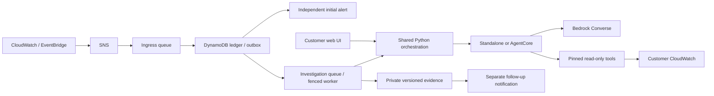

# AIOps Assistant — Kira

Implementation status: Phases 3–4 durable incidents, shared Python orchestration
and detection/observability are implemented locally with standalone and AWS AgentCore
execution options.
Hosted CI and AWS staging remain pending. See [implementation state](docs/implementation/STATE.md),
[task tracker](IMPLEMENTATION_TRACKER.md) and [deployment guide](docs/implementation/phase-3/GUIDE.md) and [observation guide](docs/implementation/phase-4/GUIDE.md).
This is not a qualified production release. Customers operate their own
infrastructure and credentials; the project provides no managed service. Desktop
packaging is planned later.

Kira investigates EC2 incidents using customer-owned Bedrock models and CloudWatch
logs/metrics. Customers select where the same Python orchestration runs:
`standalone` (incident Lambda; web chat directly) or `agentcore` (their AWS Runtime).

- **Chat** — ask through the password-protected Streamlit UI.
- **Automatic** — accepted alarms/events enter a durable incident ledger. Initial
  notifications run independently; investigations save private versioned reports
  and queue a separate follow-up notification.



**What fetch_logs gives the agent:** paginated discovery of an instance’s log groups (Nginx, each container, …); the lines just before and just after the incident time; and per-minute log activity across the window with silent gaps called out. A log gap requires corroborating telemetry; quiet traffic or a collector failure can also cause silence.

---

## Current deployment path

Use the [Phase 3 owned-runtime workflow](docs/implementation/phase-3/GUIDE.md)
for new deployments. It creates immutable tools/runtime candidates and requires
reviewed changes, verification and an explicit staging canary before promotion.
It does not require Bedrock Agents Classic creation. Start locally:

```bash
python3.12 -m venv .venv
.venv/bin/python -m pip install --require-hashes -r requirements/dev.lock
.venv/bin/python -m infra.durable --spec infra/deployment.example.json --config infra/durable.example.json --output .local/phase3/reference-plan
```

The example is synthetic, investigations are paused and cloud commands refuse it.
Customer files belong in ignored private storage. Copy `.env.example` for UI
configuration and use the verified routing `RuntimeConnection` output. Use SSO,
assumed roles or workload credentials through the standard AWS credential chain.

Owned model execution counts exact input tokens and reserves the maximum output
allowance before inference. Aggregate incident budgets survive retries and remote
connection loss. Query counts/windows are bounded; these are not hard AWS spend
or billed scan-byte caps. Actual model/region support and both hosting targets
require AWS qualification. See the [runtime decision](docs/implementation/phase-3/RUNTIME_DECISION.md).

The [Phase 2 guide](docs/implementation/phase-2/GUIDE.md) remains historical for
eligible Classic installations. Its resource [ownership guidance](docs/implementation/phase-2/OWNERSHIP.md)
still applies. The following older instructions describe Classic development.

The shell instructions below are retained as a **legacy development reference**.
They are disabled by default and cannot deploy staging/production. A development
operator must explicitly set `ALLOW_LEGACY_DEVELOPMENT_DEPLOY=true` to use them;
that workflow still edits mutable functions. Prefer the CloudFormation path.

## 1. Legacy configuration

```bash
cp config.env.example config.env     # read by every setup script
python3.12 -m venv .venv
.venv/bin/python -m pip install --require-hashes -r requirements/app.lock
```

Fill in `config.env`. Every script reads it and nothing region-, account- or instance-specific is hard-coded anywhere else. The file is git-ignored.

| Setting | Needed by | What to put |
|---|---|---|
| `EXPECTED_ACCOUNT_ID` | all | Your 12-digit AWS account; compared to STS before writes |
| `ENVIRONMENT` | all | `development`, `staging`, or `production` |
| `LOG_CURSOR_SECRET` | setup-lambdas.sh | Unique 32–256 byte secret; generate locally and keep private |
| `METRIC_CATALOG_FILE` | all | Valid JSON descriptor catalog; defaults to the empty committed catalog |
| `MONITOR_REGION` | all | Region your EC2 instances run in |
| `BEDROCK_REGION` | all | Region with Bedrock Agents + your model (can equal `MONITOR_REGION`) |
| `BEDROCK_MODEL_ID` | deploy.sh | Model or inference-profile ID supported by Bedrock Agents in that region |
| `BEDROCK_AGENT_ID` | setup-alerts.sh | Printed by `deploy.sh` |
| `BEDROCK_AGENT_ALIAS_ID` | setup-alerts.sh | The versioned alias you create (step 3) |
| `ALERT_EMAIL` | setup-alerts.sh | Where incident reports go |
| `INSTANCE_IDS` | setup-lambdas.sh, setup-alerts.sh | **All** monitored instances, comma-separated, every run |
| `CONTAINER_NAMES` | optional | e.g. `mobilebff,webbff,sso` — pre-creates their log groups |

Configuration is validated before cloud changes. Unknown keys are rejected; defaults are explicitly exported. Files use literal `KEY=VALUE` entries, not executable shell. See `config.env.example` and the Phase 1 guide. Validate locally with `.venv/bin/python -m kira.config config.env --purpose tools`. Check regional quotas before choosing concurrency; the inspected new account cannot use the example reservation without a quota change.

## 2. Deploy (current development workflow)

```bash
./setup-iam.sh        # roles: tool Lambdas (log reads limited to /aiops/*), Bedrock Agent
./setup-lambdas.sh    # fetch_logs + fetch_metrics in BEDROCK_REGION
./deploy.sh           # creates or updates the agent, action groups, permissions; waits until PREPARED
```

## 3. Bedrock steps (manual, in the console)

`deploy.sh` prints these with your agent ID filled in:

1. Test the DRAFT in the agent's test pane.
2. **Create an alias** (e.g. `live`). This snapshots the prepared DRAFT as a numbered version. Put the alias ID in `config.env` (`BEDROCK_AGENT_ALIAS_ID`) and in the chat UI's environment, and put the agent ID in both too.
3. **After every later `./deploy.sh`**, edit the alias and choose "Create a new version and associate it to this alias". The agent alias retains its version, but tool Lambda code is still mutable in this workflow. Use the Phase 2 workflow for release isolation and reviewed rollback. Its live staging gate remains pending.
4. If `deploy.sh` says the old `aiops-fetch-health` Lambda still exists, delete it with the command it prints.

Don't use `TSTALIASID` in production: it follows the editable DRAFT.

## 4. Alerting

```bash
./setup-alerts.sh
```

It validates every instance ID, then creates the SNS topics, the trigger Lambda (600 s timeout, no retries, capped concurrency), the EC2 stop/terminate rule for exactly your instances, and the per-instance alarms. It also adds a watcher alarm that emails you if the trigger Lambda itself starts failing.

Memory, disk and process alarms are **only created if CWAgent is already publishing that metric with the right dimensions**. If it isn't, the script warns and skips the alarm rather than creating one that would never fire. Re-run the script after setting up CWAgent (step 5).

**Click the SNS confirmation email.** No report arrives until you do.

## 5. Per-instance setup (manual, on each server)

**a. IAM:** attach the AWS-managed `CloudWatchAgentServerPolicy` to the instance's IAM role. Without it, neither CWAgent nor Docker's awslogs driver can write anything.

**b. CWAgent:** install it and start it with `cwagent-config.example.json`:

```bash
sudo /opt/aws/amazon-cloudwatch-agent/bin/amazon-cloudwatch-agent-ctl \
  -a fetch-config -m ec2 -s -c file:/path/to/cwagent-config.example.json
```

Three settings in that file are load-bearing:
- `append_dimensions.InstanceId` makes metrics filterable per instance.
- `aggregation_dimensions` is what lets the disk alarm match. CWAgent otherwise tags disk metrics with `device` and `fstype` too, and an alarm on `InstanceId + path` would never fire.
- The two Nginx file entries ship `access.log` and `error.log` to `/aiops/{instance_id}/nginx-access` and `nginx-error`, which the Nginx alarm reads.

If you change `LOG_GROUP_PREFIX`, change `/aiops` in this file too. For the optional process alarm, add a `procstat` section (`"procstat": [{"exe": "<process>", "measurement": ["pid_count"]}]` under `metrics_collected`) and set `ENABLE_PROCESS_ALARM=true`.

**c. Containers:** change each `docker run` for `mobilebff`, `webbff` and `sso` to:

```bash
INSTANCE_ID=$(TOKEN=$(curl -sX PUT http://169.254.169.254/latest/api/token -H "X-aws-ec2-metadata-token-ttl-seconds: 60") \
  && curl -s -H "X-aws-ec2-metadata-token: $TOKEN" http://169.254.169.254/latest/meta-data/instance-id)

docker run ... \
  --log-driver=awslogs \
  --log-opt awslogs-region=<MONITOR_REGION> \
  --log-opt awslogs-group=/aiops/$INSTANCE_ID/mobilebff \
  --log-opt awslogs-create-group=true \
  --log-opt mode=non-blocking \
  --log-opt max-buffer-size=25m \
  ...
```

- `awslogs-create-group=true`: without it, a container **refuses to start** if its log group doesn't exist yet.
- `mode=non-blocking`: the default blocking mode can stall your application's writes to stdout when CloudWatch is slow or throttling. The cost of non-blocking is that logs can be dropped if the 25 MB buffer fills.

Roll this out one container at a time and check each one comes back up.

**d. Re-run `./setup-alerts.sh`**, about 5 minutes after CWAgent starts, so the memory and disk alarms get created. Warnings list whatever is still missing.

**e. Verify the Nginx filter** against your real log format. The default pattern assumes nginx's standard `combined` format:

```bash
aws logs test-metric-filter --region <MONITOR_REGION> \
  --filter-pattern "$(grep ^NGINX_ACCESS_FILTER_PATTERN config.env | cut -d= -f2- | tr -d "'")" \
  --log-event-messages "<paste a real 504 line from access.log>" "<paste a normal 200 line>"
```

Exactly the 504 line should match. If your `log_format` adds or removes fields, edit `NGINX_ACCESS_FILTER_PATTERN` so the field positions line up, then re-run `setup-alerts.sh`.

## 6. Customer-operated chat UI

Copy `.env.example` to the ignored `.env`. Set `APP_PASSWORD` (12–256 characters),
`ENVIRONMENT`, `BEDROCK_REGION`, `BEDROCK_AGENT_ID`, and a versioned
`BEDROCK_AGENT_ALIAS_ID`. Use your AWS profile/SSO session locally or a workload
role when hosting it. The credential provider chain stays on the server running
Streamlit; opening the web page does not connect to the browser user's AWS profile.
The identity needs `bedrock:InvokeAgent` on the intended agent-alias ARN.

```bash
.venv/bin/streamlit run app.py --server.address 127.0.0.1
```

The setup screen works before an agent exists. Opening it creates no cloud resources.
The connection shows “configured” until a request succeeds. Errors expose a short
reference; partial responses remain visible. See the Phase 1 guide for session limits.
Shared-password authentication and browser-local work limits are development controls;
individual identity, authorization and shared budgets remain Phase 5 work. Do not
expose this baseline to the public internet as a production service.

## 7. Test end to end

```bash
python3 scripts/generate_sample_data.py --region <MONITOR_REGION> --instance-id <id>   # writes logs with a 10-minute silent gap
aws cloudwatch set-alarm-state --region <MONITOR_REGION> \
  --alarm-name aiops-<id>-status-check-failed --state-value ALARM --state-reason test
```

You should get an email within a few minutes. In chat, ask about the gap time the sample script printed: Kira should find the `sample-app` group and report the silent gap.

---

## Cost

The deploying customer pays their AWS costs. Set a budget before provisioning and
check regional pricing for Bedrock, CloudWatch, Lambda, SNS and EventBridge for the
chosen model and traffic. Local tests use mocks and do not invoke AWS. Browser
request limits are not an account-wide spend cap. See the [deployment and cost guide](docs/implementation/phase-3/DEPLOYMENT_AND_COST.md) for manual setup, hosting and the standalone pilot.

## Troubleshooting

- **No incident emails:** first, did you confirm the SNS subscription? Then check the alarm really went to `ALARM`, then the `aiops-trigger-investigation` logs. Handled agent failures attempt a fallback email. This legacy path can lose reports after a timeout. New deployments use the [Phase 3 durable pipeline](docs/implementation/phase-3/GUIDE.md); check incident records, outbox and delivery/consumer DLQs there.
- **Kira says a log group doesn't exist or finds none:** the instance isn't shipping to `/aiops/<instance-id>/…` yet (step 5), or `MONITOR_REGION` is wrong.
- **A `setup-alerts.sh` warning keeps coming back:** CWAgent isn't publishing that metric with the expected dimensions. Check with `aws cloudwatch list-metrics --namespace CWAgent --metric-name mem_used_percent --region <MONITOR_REGION>`.
- **`deploy.sh` fails at prepare:** read the printed `failureReasons`. Most often the model isn't enabled in Bedrock → Model access, or isn't supported for Agents in that region.
- **Changing any setting in `config.env`:** re-run the scripts from the one that uses it onward. Changing regions or the prefix means re-running from `setup-iam.sh`.

## Project structure

```
config.env.example            all settings (copy to config.env)
agent-instruction.txt         Kira's system prompt (deploy.sh uploads it)
cwagent-config.example.json   CWAgent config for each server
setup-iam.sh → setup-lambdas.sh → deploy.sh → setup-alerts.sh
scripts/common.sh             config loader + shared helpers
scripts/deploy_agent.py       agent create/update logic used by deploy.sh
scripts/generate_sample_data.py
lambda/fetch_logs, lambda/fetch_metrics, lambda/trigger_investigation
schemas/                      OpenAPI schemas for the two tools
app.py                        chat UI
```

Tests now run with `.venv/bin/python -m pytest`. The original 21 checks are in
`tests/legacy`; additional tests cover contracts, timestamps, metric dimensions,
pagination, payload boundaries and Streamlit flows. See the Phase 1 guide for
hashed installs, scans, deterministic package builds and CI commands.
