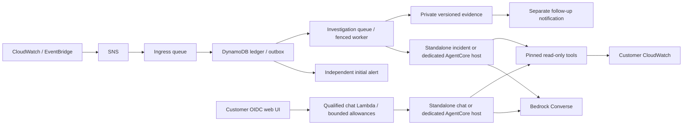

# AIOps Assistant — Kira

Implementation status: Phases 3–5 durable incidents, shared Python orchestration,
detection/observability and identity/evidence/diagnostic controls are implemented
locally with standalone and optional AWS AgentCore execution.
Hosted CI and AWS staging remain pending. See [implementation state](docs/implementation/STATE.md),
[task tracker](IMPLEMENTATION_TRACKER.md) and [deployment guide](docs/implementation/phase-3/GUIDE.md) and [observation guide](docs/implementation/phase-4/GUIDE.md).
This is not a qualified production release. Customers operate their own
infrastructure and credentials; the project provides no managed service. Desktop
packaging is planned later.

Read the [project evolution and customer onboarding overview](docs/PROJECT_EVOLUTION_AND_ONBOARDING.md)
for the original design, changes in Phases 0–5, current workflows and required manual setup.
Use the [administrator setup checklist](docs/ADMINISTRATOR_SETUP_CHECKLIST.md)
for the ordered manual AWS, CLI, server telemetry, SSO, user-grant and notification
steps from preparation to first staging login and operational UI access.

Kira investigates EC2 incidents using customer-owned Bedrock models and CloudWatch
logs/metrics. Customers select where the same Python orchestration runs:
`standalone` (separate incident/chat Lambdas) or `agentcore` (separate customer
incident/chat Runtimes, with the chat Lambda as a scoped gateway).

- **Chat** — use Streamlit with customer OIDC in staging/production; development retains a local password flow.
- **Automatic** — accepted alarms/events enter a durable incident ledger. Initial
  notifications run independently; investigations save private versioned reports
  and queue a separate follow-up notification.



**What fetch_logs gives the agent:** paginated discovery of an instance’s log groups (Nginx, each container, …); the lines just before and just after the incident time; and per-minute log activity across the window with silent gaps called out. A log gap requires corroborating telemetry; quiet traffic or a collector failure can also cause silence.

---

## Deployment and first use

The administrator runs the Python CLI from a trusted machine. CloudFormation
creates the configured backend in the customer's AWS account. The administrator
also configures server telemetry, OIDC/MFA, user grants and recipient confirmations.
The [deployment automation CLI](docs/DEPLOYMENT_AUTOMATION.md) supplies private
settings templates, offline dry-run, read-only account/permission checks and
resumable apply. Server collectors, provider registration/native login and real
inbox confirmation remain customer tasks.

Start with the [administrator checklist](docs/ADMINISTRATOR_SETUP_CHECKLIST.md).
It distinguishes first staging login from verified operational access. Detailed
procedures are in the [backend guide](docs/implementation/phase-3/GUIDE.md),
[telemetry/observation guide](docs/implementation/phase-4/GUIDE.md),
[identity/chat setup](docs/implementation/phase-5/SETUP.md) and
[security operations](docs/implementation/phase-5/SECURITY_OPERATIONS.md).

| Command / script | Current purpose |
| --- | --- |
| `python -m infra.automation init / dry-run / check / apply / status` | Configure, preview, preflight and resume the customer deployment |
| `scripts/run_customer_ui.py` | Start the loopback UI from generated references with a scoped role profile |
| `python -m infra build` | Build both inventory-bound log/metric tools |
| `scripts/build_pipeline.py` | Build the six durable pipeline functions |
| `scripts/build_observations.py` | Build health, notification canary and receipt functions |
| `scripts/build_lambdas.py --function incident_investigate --architecture arm64` | Build the optional AgentCore host |
| `python -m infra.durable` | Render the reviewed staged infrastructure plan |
| `python -m infra.durable_ops` | Upload, inspect/execute stages, collect/seal versions and verify/canary/promote |
| `python -m infra.identity_ops` | Review/apply user grants and pin release signing versions |
| `python -m infra.security_ops` | Access review and reviewed evidence erasure |
| `scripts/collector_heartbeat.py` | Write a local server heartbeat for CWAgent to ship |
| `scripts/replay_incident.py`, `scripts/replay_notification.py` | Explicit reviewed recovery operations |

Root shell deployment scripts, the direct-trigger Lambda and Agents Classic
compatibility have been removed. Supported runtimes are `standalone` and
`agentcore`. Historical audit/phase records retain the original design and its
validation checkpoints; use current guides for deployment.

## Local preparation and UI preview

Use Python 3.12. Install the app lock for UI-only work or the development lock for
build/test work:

```bash
python3.12 -m venv .venv
.venv/bin/python -m pip install --require-hashes -r requirements/app.lock
```

Initialize a private `.env` from `.env.example` only if one does not already
exist. For a local preview, set `ENVIRONMENT=development` and a private
`APP_PASSWORD` of at least 12 characters. Opening the UI creates no AWS resources.
Without verified runtime bindings, login shows the setup screen and chat is disabled.

```bash
.venv/bin/streamlit run app.py --server.address 127.0.0.1
```

For staging/production, configure native OIDC and copy the exact verified
`RuntimeConnection` fields plus foundation storage references into the UI environment.
The UI uses the AWS credential chain and its scoped workload role. Browser login
and AWS workload access are separate. Hosted UI access also needs customer HTTPS,
proxy/origin configuration and a reachable authenticated incident-status URL.

## Offline build and validation

```bash
.venv/bin/python -m pip install --require-hashes -r requirements/dev.lock
.venv/bin/python -m pytest -q
.venv/bin/ruff check .
.venv/bin/ruff format --check .
.venv/bin/python scripts/validate_schemas.py
.venv/bin/python scripts/check_secrets.py
.venv/bin/python -m pip download --require-hashes --only-binary=:all: --dest .build/wheels -r requirements/lambda.lock
.venv/bin/python -m infra build --spec infra/deployment.example.json --output .build/reference-tools --wheelhouse .build/wheels
.venv/bin/python -m infra.durable --spec infra/deployment.example.json --config infra/durable.example.json --output .local/reference-plan
```

The committed examples are synthetic; cloud commands reject them before clients
are constructed. Rendering does not deploy anything. Current CI also checks
foundation/runtime/observation/identity templates, independent deterministic builds,
isolated package imports and all eight standalone/AgentCore release layouts.
Local tests are not AWS or production qualification.

## Repository map

| Path | Purpose |
| --- | --- |
| `app.py`, `.env.example`, `.streamlit/config.toml` | Web UI and public configuration shapes |
| `kira/` | Shared orchestration, identity, safety, tools and durable processing |
| `kira_agentcore.py` | Optional AWS AgentCore entry point |
| `agent-instruction.txt`, `schemas/` | Runtime prompt and tool contracts used by both targets |
| `lambda/` | Two read-only tools, six incident handlers and three observers |
| `infra/` | Current inventory, CloudFormation generation and operator CLI |
| `scripts/` | Current build, validation, evaluation, collector and recovery tools |
| `tests/`, `evaluations/` | Offline regressions and reviewed diagnostic cases |
| `requirements/` | Separate hash-locked UI/development/deployed dependencies |
| `docs/` | Onboarding, operational guides and preserved audit/implementation records |
| `.local/`, `.build/` | Ignored private inputs, receipts and generated artifacts |

Inventory is explicit and release-owned. Server collectors must publish the
configured metrics/logs; new instances or changed scopes need a reviewed release.
The current health probe supports approved public HTTPS routes; VPC-only probing
needs additional work. Recommendations are for human review; Kira does not repair
customer workloads automatically.
