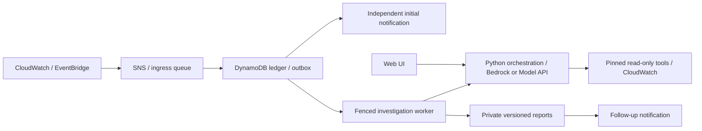

<picture>
  <source media="(prefers-color-scheme: dark)" srcset="assets/kira-logo-white.png">
  
</picture>

# Kira: an AIOps assistant for your EC2 servers

When a CloudWatch alarm fires, Kira reads the logs and metrics of the affected
server, asks an AI model (Amazon Bedrock by default) to reason over that evidence,
and writes a short report that separates what was observed from what is only a
guess. You get the alert first and a link to the report when it is ready. You can
also ask questions in a web chat. You run all of it in your own AWS account.

- **Read-only.** Its tools only read CloudWatch logs and metrics for the EC2 instances you list.
- **No automatic fixes.** Kira suggests; a person decides and acts.
- **Your account.** Everything is deployed and operated by you, in your AWS regions.
- **You pay for what you use.** AWS bills Bedrock, CloudWatch, Lambda and the other services to you. A Model API provider, if you pick one, bills you separately.
- **No hosted service.** There is no maintainer account, control plane or subscription.

> **Status:** locally tested, never run against real AWS. Treat your first deployment as staging.

## How it works



The first alert is sent without waiting for the model. Each investigation is
limited in tokens, tool calls, query windows and time. Missing logs alone are not
treated as proof of a hang. See the [architecture and glossary](docs/ARCHITECTURE.md).

## Three choices

You make each choice when you deploy. The defaults need the least setup.

| Choice | Default | Option |
| --- | --- | --- |
| Who signs in | **Local single-user mode.** One shared password protects the web UI. | **OIDC module.** Sign-in through your identity provider with MFA, per-person grants, revocation, audit and quotas. |
| Which model | **Amazon Bedrock.** | **Model API.** An OpenAI-compatible or Anthropic Messages endpoint. Its key lives in AWS Secrets Manager. |
| Where it runs | **Standalone AWS Lambda.** | **Amazon Bedrock AgentCore.** Bedrock only, so it cannot be combined with a Model API. |

Pass `--identity` to `init` for the OIDC module. Set `model_provider` in
`deployment.json` for a Model API. The [deployment guide](docs/DEPLOY.md) covers both.
The Model API option has never run against a live provider, and diagnosis quality
on non-Claude models is unmeasured.

## Try the UI locally in about 10 minutes

You need Python 3.12. The preview needs no AWS account. Create a virtual environment and
activate it. Every command in this README then works as written, as long as your prompt
shows `(.venv)`. Run the `source` line again in each new terminal.

```bash
python3.12 -m venv .venv
source .venv/bin/activate
python -m pip install --require-hashes -r requirements/app.lock
cp .env.example .env    # skip this if you already have a .env, and keep yours
chmod 600 .env
```

In `.env`, keep `ENVIRONMENT=development` and set `APP_PASSWORD` to a private value
of at least 12 characters. Then start the UI and open `http://127.0.0.1:8501/`:

```bash
streamlit run app.py --server.address 127.0.0.1
```

Sign in with that password. With no backend settings, the UI shows a "Connect your
runtime" checklist and chat stays disabled. That is expected. The same password
sign-in is the default mode of a deployed backend; the FAQ explains what it does and
does not protect.

### Try it against your own CloudWatch (no deployment)

For development, the UI can run its two read-only tools (`fetch_logs`, `fetch_metrics`) in
its own process with your AWS credentials. You skip the tool Lambdas and `infra.automation`.

1. Write the one-file tool config: copy `examples/local-tools.example.json` and edit it, or
   generate it from a `deployment.json` (the shape of `examples/deployment.example.json`).
   Generating makes no AWS call and will not overwrite a file without `--force`:
   `mkdir -p .local && python scripts/make_local_tools.py --spec deployment.json --out .local/local-tools.json`
2. In `.env`, set `KIRA_LOCAL_TOOLS=.local/local-tools.json`, `APP_PASSWORD`, `BEDROCK_REGION`,
   `BEDROCK_MODEL_ID` and `EXPECTED_ACCOUNT_ID`. Keep `ENVIRONMENT=development` and the prefilled
   `RUNTIME_LIMITS`. Leave `LOGS_TOOL_ARN`, `METRICS_TOOL_ARN` and `RUNTIME_RELEASE` empty.
3. Use a read-only AWS profile (`AWS_PROFILE` in `.env`, or an SSO sign-in) with
   `logs:DescribeLogGroups`, `logs:StartQuery` (billable), `logs:GetQueryResults`,
   `logs:StopQuery`, `cloudwatch:GetMetricStatistics`, and `bedrock:InvokeModel` and
   `bedrock:CountTokens` on your model. Kira does not check that it matches `EXPECTED_ACCOUNT_ID`.
4. Run `streamlit run app.py --server.address 127.0.0.1` and sign in. "Connection details"
   shows "Local tools (this machine's AWS credentials)".

**Limits.** The tools read only log groups named `<log_prefix>/<instance-id>/<suffix>`, the
layout of the agent file in [SERVERS.md](docs/SERVERS.md). Other groups, such as `/aws/lambda/...`,
are out of reach. The UI process holds your read credentials, so Kira's checks run in code and
IAM does not back them up. Keep the UI on `127.0.0.1`. Use the deployed tools for anything
shared or production. This mode has never run against real AWS either.

## Deploy to your AWS account

Run from a clean, committed checkout on macOS or Linux (Windows: WSL) with the
development lock installed. Init, fill in the three private files it writes, dry-run, check,
apply, then launch the UI:

```bash
# Default local single-user mode. Add --identity for the OIDC module.
python -m infra.automation init --work-dir .local/customer
python -m infra.automation dry-run --config .local/customer/automation.json --work-dir .local/customer
python -m infra.automation check --config .local/customer/automation.json --work-dir .local/customer
python -m infra.automation apply --config .local/customer/automation.json --work-dir .local/customer --plan-hash YOUR_PLAN_HASH
python -m infra.automation status --work-dir .local/customer
# Default mode only: set the UI password (12+ characters) in this shell. .env is not loaded.
read -rs APP_PASSWORD; export APP_PASSWORD
python scripts/run_customer_ui.py --connection .local/customer/ui-connection.json --profile customer-ui
```

`dry-run` makes no AWS calls and shows the plan hash. `check` only reads AWS.
`apply` creates billable resources, stops at steps only you can do (the paid canary,
confirming inboxes and, with the OIDC module, identity-provider sign-in) and ends with
investigations paused. The generated files are synthetic examples that `check` and
`apply` reject until you replace them with real values; keep them private. For a
Model API, create its key secret in Secrets Manager yourself before `check`. You also
set up your servers and UI hosting yourself, and your identity provider if you use
the OIDC module. Full steps: [deployment guide](docs/DEPLOY.md).

## What does it cost?

There is no cost estimate yet. The main cost drivers are:

- **Model tokens** for each automatic investigation and each chat question: Bedrock, or your Model API provider's bill.
- **CloudWatch** log ingestion, Logs Insights queries, metrics and alarms.
- **Always-on storage and keys:** DynamoDB (with point-in-time recovery), S3 versioning, KMS and Secrets Manager.
- **Messaging and compute:** Lambda, SNS and SQS, plus optional AgentCore.

Limits on tokens, tool calls and queries bound each request, but they are not a
dollar cap, and billing alerts do not stop spend. Stored data, keys and alarms keep
costing money while investigations are paused. Watch Cost Explorer for the first
week, and set a budget before you enable investigations. To cut model spend fast,
pause investigations and stop chat ([operations](docs/OPERATE.md)).

## FAQ

**Does Kira change my servers?** No. Its tools only read CloudWatch logs and
metrics, and recommendations are text for a person to review. Setup does create
AWS resources of its own, and you install the CloudWatch agent on your servers
yourself ([server setup](docs/SERVERS.md)).

**Can I use it without OIDC/SSO?** Yes, that is the default. The UI then has one shared
password, and chat runs with the UI's own AWS role and no gateway. The instance
allowlist, pinned tools, runtime limits, release binding and redaction still apply.
Per-person identity, audit, revocation and a shared spend cap do not exist, and the
20 requests per hour limit is per browser session, so a new session resets it.
Anyone with the password can use the model and tools the UI role reaches and read
every incident report. Keep the UI on `127.0.0.1` or behind your own SSO or VPN
proxy, or enable the OIDC module. Details: [SECURITY.md](SECURITY.md).

**What if the model is down?** The initial alert is still sent. The investigation is
retried within fixed limits, then recorded as degraded ("operator review
required"). Chat shows an error with a reference.

**Is my data sent anywhere?** With Bedrock, redacted log and metric excerpts go to
Amazon Bedrock in your account and region. With a Model API, those excerpts and the
questions you type leave your AWS account for the provider's HTTPS endpoint. That
provider sets its own retention and quotas and bills you. Reports are stored in a
private, versioned S3 bucket you own. Output is redacted by pattern matching before
it returns to the model or is stored; this is best effort, not a guarantee. Kira
makes no calls to the maintainers, and Streamlit usage statistics are turned off.

**Can I use a model other than Bedrock?** Yes, on standalone Lambda: an
OpenAI-compatible endpoint with tool calling, or the Anthropic Messages API. Run the
paid staging canary and the [diagnostic evaluation](evaluations/diagnostics/README.md)
against it first. An OpenAI-compatible endpoint has no token-count call, so Kira
reserves a local estimate that is not an upper bound. It stops the run if the provider
reports more input than estimated, or no usage.

**What is not supported yet?** Automatic server discovery (you list instances),
health probes of private VPC-only endpoints, a desktop app, Windows servers (the
telemetry setup is for Linux EC2) and a Model API with AgentCore.

## Documentation

1. [Prerequisites](docs/PREREQUISITES.md): what must exist and be decided before you run the deploy tool.
2. [Deployment guide](docs/DEPLOY.md): prerequisites, costs, setup, the optional identity module and Model API.
3. [Server setup](docs/SERVERS.md): CloudWatch agent, heartbeat and Nginx on your hosts.
4. [Operations](docs/OPERATE.md): incidents, replay, recipients, rotation, erasure, restore.
5. [Architecture](docs/ARCHITECTURE.md): components, workflows and a glossary.
6. [Live acceptance](docs/ACCEPTANCE.md): the checklist to complete before relying on it.
7. [Diagnostic evaluations](evaluations/diagnostics/README.md): synthetic cases and optional paid model tests.

## Contributing and license

See [CONTRIBUTING.md](CONTRIBUTING.md) for setup and checks, and
[SECURITY.md](SECURITY.md) to report a vulnerability privately. Released under the
[MIT license](LICENSE). Dependencies keep their own licenses.
