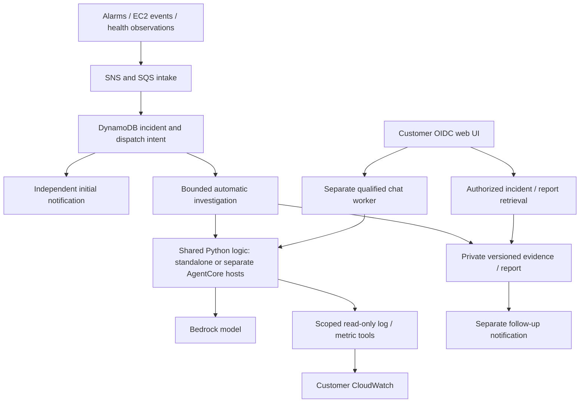

# Kira: project evolution, workflow and customer onboarding

**As of 7 October 2026 — implementation through Phase 5.**

Kira investigates a customer's AWS EC2 services using CloudWatch evidence and
Bedrock models. The customer owns the infrastructure, credentials, data and bill.
The intended distribution is open source; there is no maintainer-operated SaaS or
managed service. Web chat, alerts and notifications are implemented; Mac/Windows
desktop packaging is future work.

**Current status: locally implemented through Phase 5; live verification pending.**
No project infrastructure has been deployed and Phase 6 has not started. Local
checks pass: 631 tests, 94 templates, 13 package pairs, eight synthetic layouts and
16 offline evaluation cases. These do not establish production readiness.

## 1. What the project was before this work

The prototype had a Streamlit chat UI, read-only log/metric Lambda tools, an
investigation Lambda, Bedrock Agents Classic, shell deployment scripts and
CloudWatch/EventBridge alerts. It had input checks and 21 embedded self-checks.

Its automatic flow was:

**Alarm/event → SNS → investigation Lambda → Bedrock agent → tools → email.**

Chat called the agent directly. Email depended on the same long-running
investigation, without durable state or an independent initial alert. Duplicates
could repeat paid work; timeouts/publication failure could lose results. Mutable
tools and fixed names made release/environment isolation unreliable. Access used
a shared password; evidence lacked systematic redaction and uncertainty rules.

The audit recorded **20 findings**, including incorrect timestamps/dimensions and
response-size/schema defects. The assessment covered source; no deployed project
existed in the customer's configured AWS account.

## 2. What changed in each phase

| Phase | What we implemented | Effect on the workflow |
| --- | --- | --- |
| **0 — Baseline and requirements** | Preserved existing work, captured source/architecture, reproduced defects, recorded synthetic inventory, prerequisites and acceptance gates | Established a recoverable starting point and explicit tracking. No application behavior changed. |
| **1 — Correctness and UI** | Shared configuration/time/metric/transport code; validated schemas; exact metric dimensions; bounded paginated logs and UTF-8 responses; pinned dependencies, deterministic builds and CI; refreshed UI and safe error states | Tools query the intended time/series and report missing or partial coverage. Configuration errors fail early; users can recover from failed chat without raw exceptions. |
| **2 — Safe releases** | Environment/account-scoped CloudFormation, separate IAM/secrets, immutable numbered versions, artifact/contract binding, reviewed change sets, coverage checks and owned-resource retirement | A candidate is built and verified before routing changes. Staging and production have distinct names; rollback retains the matching code/configuration/tool set. |
| **3 — Durable incidents** | SQS intake, DynamoDB incident/outbox records, duplicate suppression, correlation, leases/fencing, independent initial notifications, bounded investigation/checkpoints, private versioned reports and separate follow-up delivery | An accepted incident has durable state. AI failure does not prevent the initial alert. Delivery recovery does not need to rerun AI. Shared Python orchestration runs in Lambda or optional AgentCore. |
| **4 — Detection and visibility** | Service/readiness probes, collector metric-plus-log freshness, recovery links, separate Nginx request/diagnostic metrics, operational dashboard, synthetic notification/receipt checks and fallback alarms | Monitoring can distinguish unhealthy applications from broken telemetry. Operators can inspect pipeline failures and recovery; provider acceptance is kept separate from actual inbox receipt. |
| **5 — Identity, safety and diagnosis** | Customer OIDC/MFA, scoped grants/sessions, revocation, distributed allowances, isolated chat workers/AgentCore hosts, redaction, retained access audit, controlled deletion, exact diagnosis citations, evaluation fixtures and security runbooks | Identity and scope are enforced in the backend. Chat has bounded separate capacity; reports are authenticated. Unsupported conclusions are rejected or qualified, and recommendations require human review. |

After reviewing Phases 1–4 we also corrected IAM verification, bootstrap ordering,
resumable recovery sweeps, notification ambiguity/replay, per-service observer
isolation, duplicate receipt handling and bounded remote SDK waits. Those fixes
have local evidence; their live qualification remains open.

The runtime is **code-owned Python orchestration using Bedrock Converse**, with
standalone/AgentCore options and no orchestration-framework service dependency.
Agents Classic is legacy compatibility, outside the new-customer onboarding path.

## 3. Where it runs now

| Component | Location |
| --- | --- |
| Web chat and incident viewer | Customer laptop or customer-hosted Python/Streamlit UI |
| Capture, queues, incident state, notifications, investigation and evidence | Customer AWS account: Lambda, SQS, DynamoDB, SNS, S3/KMS and CloudWatch/EventBridge |
| Standalone runtime — default | Separate automatic-investigation and chat Lambdas sharing the Python code |
| AgentCore runtime — optional | Separate customer incident/chat Runtimes and pinned endpoints; chat enters through its qualified Lambda gateway |
| Collectors and application services | Customer's existing monitored servers; Kira does not create the application fleet |

Automatic processing continues when the UI is closed. Local chat needs no dedicated
EC2 UI server. **Reachable notification links require a stable authenticated HTTPS
UI/status URL**, which the current deployment configuration requires. A local UI
alone is not an always-reachable team incident portal; an existing customer host
with TLS can provide it.

### Automatic investigation, step by step

1. Declared alarms, EC2 events or health observations emit a signal into SNS/SQS.
2. Ingress checks origin/scope/time and transactionally stores event, incident and
   dispatch intent. Duplicate identities do not create new paid work; related
   signals and recovery transitions can link to the incident.
3. An independent notifier sends the initial operational alert without waiting for AI.
4. A queued worker claims a lease/fence and checks scope, deadline and allowance.
   The selected runtime counts/reserves tokens, calls the model and fetches bounded,
   redacted CloudWatch evidence through read-only tools.
5. The diagnosis must cite evidence/time and separate facts, hypotheses and limits.
   Hang correlation requires traffic, fresh telemetry and independent failed health.
6. Private versioned checkpoints/reports preserve results. Timeout, missing evidence
   or rejected diagnosis is explicitly incomplete/degraded.
7. A separate follow-up notification carries metadata and an authenticated incident
   reference. Recovery sweeps/DLQs expose unfinished work. Ambiguous publication
   requires reviewed handling; provider acceptance does not prove inbox delivery.

### Interactive chat, step by step

1. Customer OIDC/MFA authenticates the user; authoritative grants set role/scope,
   and the server issues an expiring signed session reference.
2. The user submits an instance, time and question. The UI invokes only the qualified
   chat Lambda using its customer workload role.
3. The backend rechecks authorization and shared/user allowances. The separate chat
   runtime performs bounded model/tool work, rechecking access during execution.
4. The UI displays a validated answer or incomplete/error state. Conversation history
   remains in session state; chat does not automatically create a stored incident.
5. Incident links separately check identity/scope before reading stored reports.
   Revoked, expired, out-of-scope and deleted evidence is denied.

The tools do not SSH into servers or execute repairs. People review and apply
recommendations. Separate workers reduce chat interference; provider-wide AWS
model/region quotas are still shared and must be qualified.

## 4. UI changes and actual boundaries

The refreshed dark UI has a workspace sidebar, setup/connection feedback, example
questions, new-conversation/sign-out and partial/error/retry states. Raw provider
exceptions are masked; configured settings are not presented as proven connectivity.

OIDC viewers read permitted reports; investigators can chat within scope. The UI
shows role, instance count, allowance and review guidance. Incident links show
status/reports/checkpoints. Service/pipeline dashboards are in **CloudWatch**.

Onboarding still uses private files and reviewed deployment stages; no provisioning
wizard or fleet auto-discovery is implemented. Shared passwords are development-only.

## 5. What must exist before live use

| Area | Customer responsibility | What the project supplies |
| --- | --- | --- |
| AWS account and permissions | Approved account/regions; CLI/SSO/assumed-role access; distinct deployment, UI, operator and server identities; verified quotas | Account guards, scoped workload policies, templates and verifiers; initial customer deployment authorization remains manual |
| Bedrock | Choose and authorize a model supporting Converse tools **and this runtime's `bedrock-runtime CountTokens` path**; verify actual region/access/throughput | Bounded runtime, token reservations and canary. Unsupported counting fails before inference; a Mantle-only counting model needs a future adapter. [AWS token-count support](https://docs.aws.amazon.com/bedrock/latest/userguide/count-tokens.html) |
| Inventory | Actual EC2 IDs, service owners, log suffixes, disk/process settings, exact metric dimensions and approved health routes | Strict static inventory validation and inventory-bound packages/alarm/log scopes |
| Identity and UI | Customer OIDC app/MFA, callback/issuer/client settings, private cookie/client secrets, UI host/TLS/origin and reviewed users/roles/scopes | Native login, generated runtime signing-secret foundation, authoritative session/grant enforcement |
| Notifications | Primary and distinct fallback recipients; confirm every SNS email subscription and test real mailboxes; fixed HTTPS status URL | Initial/follow-up topics, receipt/canary/fallback controls and reviewed recipient retirement |
| Operations and cost | Named responders/security/access/budget owners; approved retention/redaction policies and spending/capacity; live rehearsal | Bounded work, runbooks, audit/deletion/access-review tooling and validation evidence |

The previously inspected account had a Lambda concurrency quota of **10**. That
is a known prerequisite gap for the planned reservations; resolve it before live
staging. Do not assume a configured AWS CLI means the account can run the project.

Templates generate AWS resources; the operator supplies/authorizes inputs,
reviews/executes stages and collects bindings. There is no one-click installer.
Customers pay AWS usage: token/query limits are not a fixed monthly price or hard
dollar cutoff. Paused investigations do not remove storage/monitoring costs.

### Application configuration map

| Private configuration | What the operator configures |
| --- | --- |
| Deployment spec in `.local/` | Account/regions/model, workload roles, instances/log suffixes, collector/process/disk settings and service health routes |
| Durable config in `.local/` | Runtime choice, status URL/fallback recipient, retention, paused state, incident/chat budgets and identity issuer/audience |
| UI `.env` or workload environment | Verified `RuntimeConnection`, storage references and customer AWS credential-chain setup; no secret values in public files |
| `.streamlit/secrets.toml` | OIDC discovery/client/callback and independent private cookie/client secrets |
| Per-server collector/logging configuration | Inventory-derived CWAgent settings plus real application/container paths, heartbeat timer and rotation |

Default chat allowance is four admissions/user and eight/deployment per UTC hour,
with 24,000 tokens reserved per request. These are reviewed configurable limits;
changing release-bound settings requires a new candidate and reviewed grant rebinding.

### What each monitored server needs

- Configure an instance role and network access for its approved CloudWatch logs
  and metrics. Install/start CWAgent using configuration derived from the same
  reviewed inventory. Follow [AWS agent installation](https://docs.aws.amazon.com/AmazonCloudWatch/latest/monitoring/install-CloudWatch-Agent-on-EC2-Instance.html).
- Publish the declared memory/disk/process series and verify **actual dimensions**,
  not only their names. Check disk mount and process executable settings.
- Ship application/container logs into the declared environment-scoped groups:
  `/<project>/<environment>[/<segment>]/<instance-id>/<log-suffix>`. Configure real
  application file paths or container logging yourself; the generated agent
  configuration covers declared Nginx/heartbeat collection, not arbitrary app files.
- If Nginx monitoring is enabled, ship access/error logs and validate positive and
  negative filter samples against the real format. HTTP failed-request counts and
  error-log diagnostic counts are separate.
- Install `scripts/collector_heartbeat.py` under a supervised one-minute timer;
  ship `/var/log/kira-collector-heartbeat.log` through CWAgent with the fixed
  instance-ID stream. Configure permissions, rotation and synchronized time.
  The script does not install the timer or upload logs by itself.
- Provide meaningful readiness/dependency health responses. Current probes support
  reviewed public HTTPS routes; private VPC-only endpoints require additional
  adapter work. Do not make a private service public solely for onboarding.

Current examples target static Linux EC2 services. New/replaced instances require
inventory, telemetry scopes and a new reviewed release; automated fleet discovery
is not implemented. Windows collectors, arbitrary AWS resource types and broader
multi-account monitoring are not qualified by the current examples.

## 6. Onboarding sequence for a customer's AWS resources

Use the [administrator setup checklist](ADMINISTRATOR_SETUP_CHECKLIST.md) for the
manual actions, locations, configuration sources and completion checks for this sequence.

**This is the procedure for a future authorized staging pilot, not a deployment
performed here.** Start with one existing service and standalone execution to keep
the pilot small; AgentCore is selectable when its additional runtime is wanted.

1. **Prepare locally.** Obtain reviewed source, Python 3.12 and AWS CLI/SSO; create
   a virtual environment. Install `requirements/dev.lock` for build/test work or
   `requirements/app.lock` for UI-only use with `pip install --require-hashes`.
2. **Choose the pilot.** Select account/regions/model, existing service, owners,
   budget and recipients. Verify permissions/quotas. Decide UI hosting/status URL
   and register the OIDC callback/MFA policy.
3. **Declare private inputs.** Copy `infra/observability.example.json` and
   `infra/identity.example.json` under ignored `.local/`; replace all synthetic
   identities/model/endpoints/addresses. Real specs use `reference_only:false`,
   which alone does not qualify them. Keep investigation paused and schedules off.
   Review existing resource ownership before creating overlapping stacks.
4. **Build and preview.** Build inventory-bound tools, pipeline and observers; add
   the ARM64 host for AgentCore. Render/inspect resources, IAM, retention and hashes
   offline. Rendering creates no AWS resources.
5. **Bootstrap foundations.** Execute inspected regional/durable/identity/observation
   foundation change sets. Collect outputs, pin secret versions and re-render the
   limited issuer role. Confirm primary and both fallback email subscriptions.
6. **Configure servers.** Resolve log-group ownership, apply the collector/log/
   heartbeat/readiness checklist and verify actual ingestion and dimensions.
   Required telemetry must pass coverage checks.
7. **Deploy candidates.** Upload/bind exact artifacts; deploy/seal tool, incident,
   chat and observer versions. AgentCore adds separate incident/chat hosts/endpoints.
   Collect bindings/re-render; seed enabled health metrics before strict coverage.
8. **Connect identities/UI.** Store OIDC secrets in private `.streamlit/secrets.toml`;
   review/apply subject-based user grants. Copy verified `RuntimeConnection` and
   storage references into the UI environment, including `CHAT_FUNCTION_ARN`,
   release, session/key and work-policy settings. Do not invent bindings or give
   the UI direct model/tool permissions.
9. **Qualify in staging.** Check candidate/IAM/coverage; authorize the paid chat
   canary and reviewed paused routing needed for initial-delivery tests. Exercise
   access denials, faults, budgets, delivery, rollback and retention gates.
   The issuer issues a ticket; a separately scoped operator invokes candidate chat.
   Keep tickets/receipts private. These live checks are currently pending.
10. **Activate and operate.** After required live approvals, apply reviewed routing/
    retirement changes and enable approved observation/investigation. Verify real
    initial/follow-up/fallback inbox receipts. Start the UI with
    `streamlit run app.py --server.address 127.0.0.1`, behind TLS when hosted.
    Maintain access reviews, rotations, DLQs, backups, inventory and delivery tests.

This overview explains the ordering; the exact command/binding procedures are in
[owned deployment](implementation/phase-3/GUIDE.md),
[observations and collectors](implementation/phase-4/GUIDE.md),
[current identity/chat setup](implementation/phase-5/SETUP.md) and
[security operations](implementation/phase-5/SECURITY_OPERATIONS.md).
**Phase 5 setup supersedes older guides' direct-UI model invocation instructions.**
Legacy mutable shell scripts and Agents Classic walkthroughs are not the current
production onboarding path.

## 7. What remains before production reliance

Phase 6 must qualify staging integrations, capacity/model quality, cost, fault
recovery, rollback, IAM/identity/retention and real notifications/hosted CI. Phase 7
then covers production rollout/handover. Local tests close neither those gates nor
original findings. Desktop and public distribution remain later product work.

For exact status and historical evidence, see [implementation state](implementation/STATE.md),
[task tracker](../IMPLEMENTATION_TRACKER.md) and
[Phase 5 completion](implementation/phase-5/LOCAL_COMPLETION.md).
