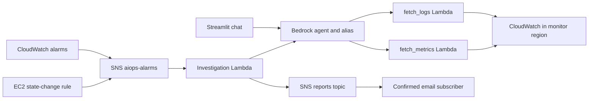

# P0.02 — Architecture and reference inventory

Scope: **new AWS deployment with synthetic service fixtures**. The user confirmed
that no EC2/Bedrock/project infrastructure has been created. The configured account
identity was subsequently verified and regional metadata inspected in `eu-central-1`;
no non-terminated EC2 instances or matching project resources were found. Account
identifiers remain in private local evidence. Other regions and global IAM resources
were not inventoried. Example names in the README (`mobilebff`, `webbff`, `sso`,
Render) are not evidence of deployment. The architecture below comes from code;
see [PREFLIGHT.md](PREFLIGHT.md) for actual capabilities and remaining gaps.

Bedrock and tool Lambdas are placed in `BEDROCK_REGION` by the scripts; EC2,
CloudWatch, SNS, EventBridge and the investigation Lambda use `MONITOR_REGION`.
The deployment account is whichever identity the AWS CLI currently resolves.
No environment/account guard or scoped stack exists yet. No durable incident
database, queue/outbox, report store or independent availability probe exists.

## Resources declared by current source

These are intended names, **not discovered cloud resources**. Actual existence,
ARNs, tags, versions, subscriptions and ownership must be checked before migration.

| Component | Name / identity in source | Role and present limit |
|---|---|---|
| UI | `app.py`; hosting is operator selected | Shared password, direct agent access; UI flaws are P1.08/P5 |
| Agent | default `aiops-assistant`; configured agent/alias IDs | Model and alias unresolved; tools reference mutable Lambda code |
| Tools | `aiops-fetch-logs`, `aiops-fetch-metrics` | Python 3.12; 60s/256MB and 30s/128MB respectively |
| Worker | `aiops-trigger-investigation` | Python 3.12; 600s/256MB; retries disabled; optional concurrency 2 |
| IAM roles | `aiops-lambda-role`, `aiops-bedrock-agent-role`, `aiops-trigger-role` | Fixed names; tools share a role; broader permissions remain |
| Topics | `aiops-alarms`, `aiops-incident-reports` | Direct ingress to worker; email confirmation not checked here |
| Event rule | `aiops-ec2-down` | Configured instance IDs, stopped/terminated events only |
| Alarms | `aiops-<instance>-status-check-failed`, `cpu-high`, `memory-high`, `disk-high`, `process-down`, `nginx-errors` | Conditional creation, no recovery handling or desired-state retirement |
| Watcher | `aiops-kira-trigger-failing` | Lambda Errors only; shares report topic |
| Log groups | `/aiops/<instance>/<container>`, `nginx-access`, `nginx-error` | Default 30-day application retention; Lambda log retention not configured |
| Legacy | `aiops-fetch-health` | May exist from an old deployment; presence/owner unknown; do not delete by assumption |

Source anchors: `scripts/common.sh`, `setup-iam.sh`, `setup-lambdas.sh`,
`setup-alerts.sh`, `scripts/deploy_agent.py`, `cwagent-config.example.json`.

## Reference service coverage

Machine-readable details: [reference-inventory.json](reference-inventory.json).
All service owners below are **operator role placeholders**, not assigned people.
All health URLs use `.invalid` and must never be deployed as real monitoring targets.

| Synthetic service | Owner role | Current detection/evidence design | Missing coverage |
|---|---|---|---|
| `reference-ec2` | Customer infrastructure operator | EC2 state/status, CPU; CWAgent memory/disk where present | Telemetry freshness, recovery, actual dimension verification |
| `reference-nginx` | Customer application operator | Nginx 502/504/upstream filters; access/error logs | Independent HTTP/listener health, stopped Nginx, format verification |
| `reference-orders` | Customer application operator | Container logs and host-level resource metrics | Per-service health/dependencies, hang vs idle distinction, deployment/OOM evidence |

The reference fleet is **static**, one synthetic instance. Maintenance is explicit
and time-bounded with an owner, reason, expiry and restoration check. Such a
maintenance mechanism is a requirement, not an implemented switch. Autoscaled
inventory, instance churn and tags require later reconciliation design.

## Exact metric descriptors needed for subsequent fixtures

| Namespace / metric | Statistic | Exact dimensions | Current tool status |
|---|---|---|---|
| `AWS/EC2 / StatusCheckFailed` | Maximum | `InstanceId` | Supported shape |
| `AWS/EC2 / CPUUtilization` | Average | `InstanceId` | Supported shape |
| `CWAgent / mem_used_percent` | Average | `InstanceId` | Requires matching emitted series |
| `CWAgent / disk_used_percent` | Average | `InstanceId, path=/` | Requires the configured aggregate |
| `CWAgent / procstat_lookup_pid_count` | Minimum | `InstanceId` in current alarm | Optional aggregate; does not identify each process separately |
| `AIOpsNginx / nginx-upstream-errors-<instance>` | Sum | **None (`[]`)** | Broken: tool always adds InstanceId (F12) |
| Operator-specific process and `AWS/EBS` volume series | Configured explicitly | Actual process descriptor or `VolumeId` | Not currently supported; fixture/catalog extension in P1.05 |

The exact namespace/name/dimension set must come from a verified customer metric
or allowlisted configuration. Do not invent additional dimensions or turn arbitrary
namespace input into an authorization policy. Empty data and denied access need
distinct results. Unit and aggregation must match each selected series.

## Unsupported or unverified scope

EKS/ECS/Kubernetes service discovery, non-AWS clouds, on-premises hosts, Windows
event collection, multiple customer tenants in one service, autoscaled fleet
reconciliation, arbitrary databases and native desktop are outside this baseline.
Operator-owned application dependencies can be described now but require explicit
instrumentation before coverage is claimed. Desktop stays in the separate product
roadmap. No service is marked healthy or monitored solely because it is configured.
